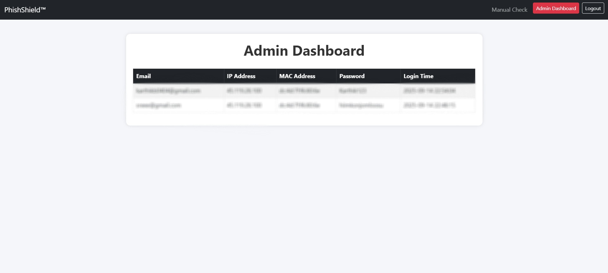
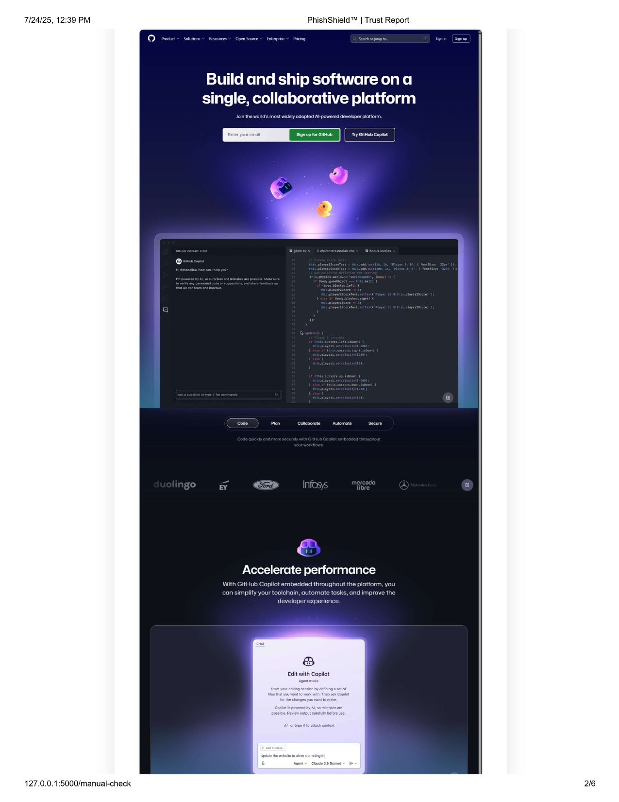

# Multi-Heuristic Phishing Detection System Using TLS, WHOIS, and OCR

A powerful Flask-based backend that detects phishing websites using multiple heuristic techniques—including TLS certificate validation, WHOIS domain checks, and OCR-based content analysis. Designed for easy integration, academic demonstrations, and extensibility into advanced cybersecurity systems.

---

## Problem Statement

Traditional blacklist or signature-based approaches are increasingly ineffective against rapidly evolving phishing attacks. To ensure higher detection accuracy, this system combines multiple real-time signals and content inspection strategies to identify malicious sites proactively.

---

## Features

- TLS certificate validation
- WHOIS domain age analysis
- OCR-based detection of phishing indicators (e.g., login forms, spoofed logos)
- Trust score generation based on multiple detectors
- Classification into: `Safe`, `Suspicious`, or `Phishing`
- Lightweight and fast Flask backend
- Modular architecture for extending with new detection methods
- JSON API ready for front-end and browser extension integration

---

## Detection Workflow & Algorithms

| Component        | Description                                | Time Complexity    | Space Complexity  |
|------------------|--------------------------------------------|-------------------|-------------------|
| TLS Validation   | Checks SSL certificate validity            | O(1)–O(log n)     | O(1)              |
| WHOIS Lookup     | Evaluates domain age and registration info | O(log n)          | O(1)              |
| OCR Detection    | Extracts visual clues from screenshots     | O(s) (s = pixels) | O(s)              |
| Score Aggregation| Computes a combined trust score            | O(1)              | O(1)              |

- **Threshold-based Classification**:
  - Safe: Score ≥ 70
  - Suspicious: 35 ≤ Score < 70
  - Phishing: Score < 35

---

## Installation & Setup

1. Clone the repository:
   ```bash
   git clone https://github.com/your-username/advanced_phishing_detection.git
   cd advanced_phishing_detection
   ```

2. Install required packages:
   ```bash
   pip install -r requirements.txt
   ```

3. Run the Flask app:
   ```bash
   python app.py
   ```

4. Access via `http://localhost:5000`

---

## Sample Output

```json
{
  "input_url": "http://example.site",
  "TLS": "Valid",
  "WHOIS": "Domain Age < 1 month",
  "OCR": "Detected login form",
  "trust_score": 34,
  "classification": "Suspicious"
}
```
---

## Screenshots
Home Page:


Registration Page:


Login Page:


Admin Page:


Result:




---

## API & UI

- **POST /scan**
  - Accepts JSON payload with a URL.
  - Returns trust score and classification.
- **Manual UI Page**
  - Simple form to input URL and display scan results.

---

## Use Cases

- Academic or classroom demonstrations on phishing detection
- Backend for browser extensions or plugins
- Integrate into security dashboards or enterprise firewalls

---

## Cybersecurity Impact

- Detects phishing attempts that evade traditional blacklists
- Scalable to integrate advanced behavioral and AI-driven detection
- Provides interpretable results for developers and end users

---

## Key Advantages

- Modular structure—easily plug in more detectors
- Lightweight backend, ideal for quick evaluations
- Return both raw diagnostic data and high-level classification

---

## Developed By

**Karthik B**  
[GitHub Profile](https://github.com/KArT4206)  
[LinkedIn](https://www.linkedin.com/in/karthik-b-0b8905362)

---

## License

This project is licensed by GPL-3.0 license.
